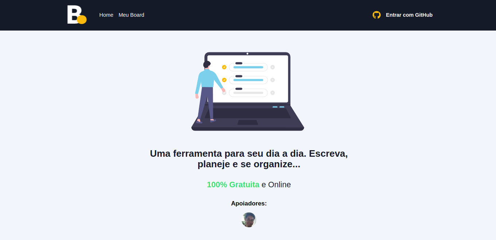
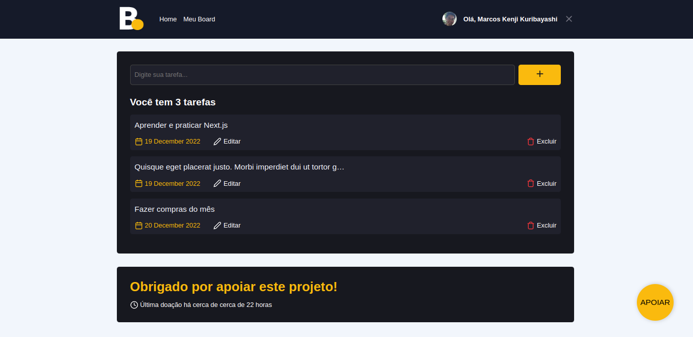
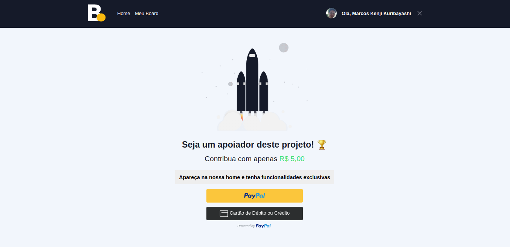
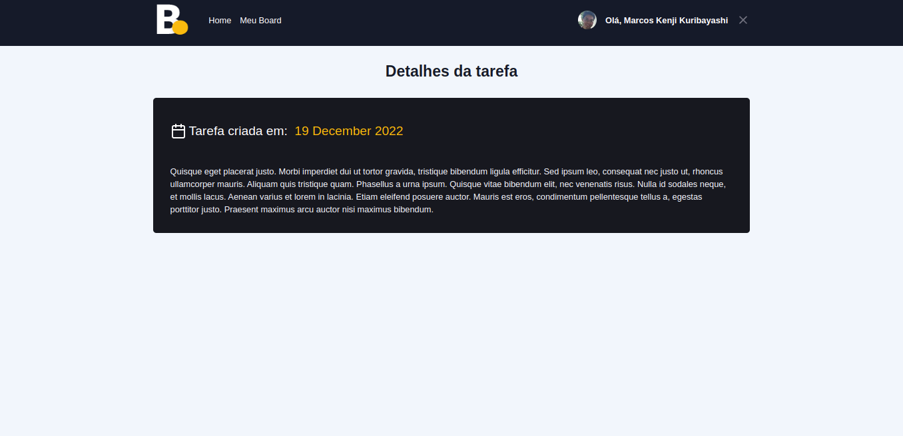

# Board 🗓️

    

## 🗂️ Índice

- **[Sobre o Projeto](#-sobre-o-projeto)**
- **[Demonstração](#-demonstração)**
- **[Layout](#-layout)**
- **[Funcionalidades](#-funcionalidades)**
- **[Tecnologias](#%EF%B8%8F-tecnologias)**
- **[Autor](#-autor)**

## 💻 Sobre o projeto

**Board** é uma aplicação básica de gerenciamento de tarefas com o objetivo de tornar o dia a dia mais fácil e eficaz.

Com ele é possível planejar compromissos, reuniões, eventos e tarefas diárias de maneira descomplicada, gratuita e online. 

Com uma interface simples e intuitiva, **Board** organiza todas as tarefas, garantindo que nada de importante seja esquecido!

## 🚀 Demonstração

**Deploy da aplicação**: 

## 🎨 Layout

  

  

  

## 💡 Funcionalidades

- [x] Tela inicial com apresentação da aplicação
  - [x] Login com GitHub
  - [x] Exibição de fotos dos apoiadores do projeto
- [x] Tela "Dashboard"
  - [x] Listagem de tarefas
  - [x] Cadastro de nova tarefa
  - [x] Exclusão de tarefa
  - [x] Edição de tarefa (somente para apoiadores)
- [x] Tela para poder apoiar o projeto 
  - [x] Pagamento via PayPal para se tornar apoiador do projeto
- [x] Tela "Detalhes da Tarefa" (somente para apoiadores)
  - [x] Exibição de informações detalhadas de uma tarefa específica

## 🛠️ Tecnologias

Para o desenvolvimento desse projeto, as seguintes ferramentas foram utilizadas:

- **[React.js](https://pt-br.reactjs.org/)**
- **[Next.js](https://nextjs.org/)**
- **[TypeScript](https://www.typescriptlang.org/)**
- **[Firebase](https://firebase.google.com/)**
- **[NextAuth](https://next-auth.js.org/)**
- **[React Hook Form](https://react-hook-form.com/)**
- **[React Icons](https://react-icons.github.io/react-icons/)**
- **[Sass](https://sass-lang.com/)**
- **[Date-fns](https://date-fns.org/)**

## 👨‍💻 Autor

Marcos Kenji Kuribayashi

 

---

Desenvolvido por Marcos Kenji Kuribayashi 😉
